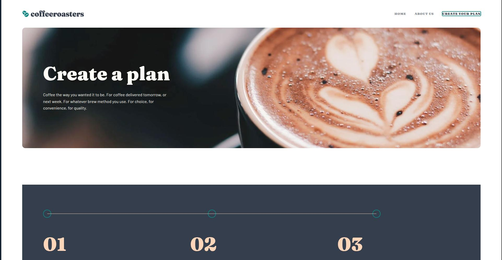

# Frontend Mentor - Coffeeroasters subscription site solution

This is a solution to the [Coffeeroasters subscription site challenge on Frontend Mentor](https://www.frontendmentor.io/challenges/coffeeroasters-subscription-site-5Fc26HVY6). Frontend Mentor challenges help you improve your coding skills by building realistic projects.

## Table of contents

- [Overview](#overview)
  - [The challenge](#the-challenge)
  - [Screenshot](#screenshot)
  - [Links](#links)
- [My process](#my-process)
  - [Built with](#built-with)
  - [What I learned](#what-i-learned)
  - [Continued development](#continued-development)
  - [Useful resources](#useful-resources)

## Overview

### The challenge

Users should be able to:

- View the optimal layout for each page depending on their device's screen size
- See hover states for all interactive elements throughout the site
- Make selections to create a coffee subscription and see an order summary modal of their choices

### Screenshot



### Links

- Solution URL: [Repository](https://github.com/azanra/coffee-subscription)
- Live Site URL: [Preview](https://azanra.github.io/coffee-subscription/)

## My process

### Built with

- [React](https://react.dev/)
- [Tailwind](https://tailwindcss.com/)
- [Typescript](https://www.typescriptlang.org/)
- [React Router](https://reactrouter.com/home)

### What I learned

To handle multiple pages, we used react router to handle moving between pages. benefit of using react router is that whenever it navigating to another page, it wouldn't refresh the pages. unlike using anchor element that will trigger refresh.

To use react router, we need to define routes that contain array of object of possible path in our apps. where each item will contain it path and what element that should render on that path.

```js
const routes = [
  {
    path: "/",
    element: <Home />,
  },
  {
    path: "/about",
    element: <About />,
  },
  {
    path: "/plan",
    element: <Plan />,
  },
];
```

After that it will create the route and provide it to route provider so that the children can consume it, im guessing that this is similar to how react context works.z

```js
const router = createBrowserRouter(routes, {
  basename: "/coffee-subscription",
});

createRoot(document.getElementById("root")!).render(
  <StrictMode>
    <App>
      <RouterProvider router={router} />
    </App>
  </StrictMode>,
);
```

To make this layout works on various screen size, there are something that is called mobile first workflow, from what i understand is that styling will be done for mobile first, if we need to target another screen size, we will used media query to apply certain styling on various breakpoint (resolution). from the design there would be 3 different screen that need to be targeted:

- 375 pixels (mobile)
- 768 pixels (tablet)
- 1440 pixels (desktop)

and from tailwind docs, we can use utility class of md for tablet screen (768px), but for desktop because there aren't existing utils that match the resolution, that why we need to create a new one for that with custom breakpoint with 90 rem where it equal to 1440 pixels.

```css
@theme {
  --breakpoint-xxl: 90rem;
}
```

```js
<div className="flex flex-col gap-[64px] md:gap-[80px] xxl:gap-[140px]">
  <CreatePlanBanner />
  <Work />
  <CustomizePlan />
  <Footer />
</div>
```

From the code above it will used 64 px gap on mobile resolution and 140 px gap on desktop resolution, those will be applied only if it will match the current media query.

because the font used will be depending on current resolution, we will create custom utility for each font. and to applied it with media query utility.

```css
@utility text-collection-tablet {
  font-family: "Fraunces";
  font-size: 112px;
  line-height: 100%;
  letter-spacing: 0px;
}
```

```js
<h1 className="text-(--neutral-50) text-preset-1-mobile md:text-preset-1 text-(--neutral-50)">
  Create a plan
</h1>
```

Same will apply to image, because it will used different image depending on current resolution, we will overwrite the current background image if it it match the current media query, background size cover used to ensure that it will match the size of current container while ensuring scale ratio of the image doesn't change

```css
.about-us-img {
  background-image: url(../assets/about/mobile/image-hero-whitecup.jpg);
  background-size: cover;
}

@media (min-width: 768px) {
  .about-us-img {
    background-image: url(..//assets//about/tablet/image-hero-whitecup.jpg);
  }
}

@media (min-width: 1440px) {
  .about-us-img {
    background-image: url(../assets/about/desktop/image-hero-whitecup.jpg);
  }
}
```

### Continued development

The responsive design for this project is done based off quick read responsive design guide on tailwind, i haven't deep dive on best practice to avoid MDN rabbit hole (eg. i don't think i should use fixed unit like px for responsive design). for now this should be good enough to fulfill responsive design requirement.

### Useful resources

- [Tailwind Responsive Design](https://tailwindcss.com/docs/responsive-design) - Explaining getting started on how to apply responsive design
- [Odin React Router](https://www.theodinproject.com/lessons/node-path-react-new-react-router) - Explaining usage of react router and how to get started.

**Note: Delete this note and replace the list above with resources that helped you during the challenge. These could come in handy for anyone viewing your solution or for yourself when you look back on this project in the future.**
